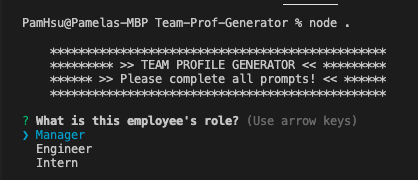
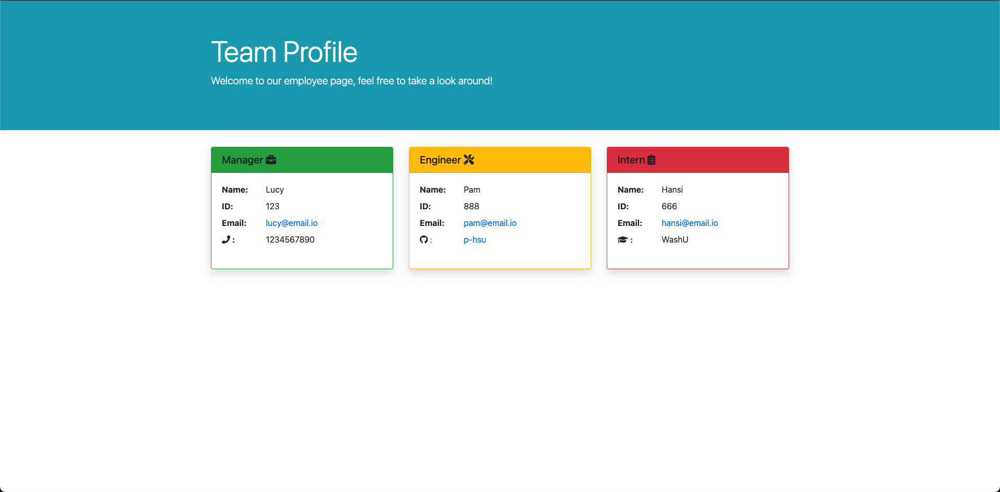

# Team-Prof-Generator

****

## Project overview

This application allows the client to generate a team portfolio webpage for their buiness/company using command line prompts. The webpage HTML and CSS are hardcoded so the generated webpage can be considered a template that the client can request modifications on.

### Project Status:

Functional

#### Issues to debug:

- code to generate html will render cards with commas due to the following in `page-teamplate.js`:


```
return [manager,engineer,intern]
```

Which results in:

```
                    </dl>
                </div>
            </div>
        </div>
        ,
        <div class="col-sm-4 pb-sm-4">
            <div class="card border-danger shadow">
                <h5 class="card-header bg-danger">Intern <i class="fas fa-clipboard-list"></i></h5>
                <div class="card-body">
```

The current solution for a user with accept to this source code is to manually delete the commas generated into the `index.html`.
****

### Project-build Aspects:

The following components are used to build the code for this project:

1. **JavaScript**
    * Node.js > npm
        - file-system *default module of npm*
        - Inquirer
        - Jest

### Functionality:

- the user will be able to input information following prompts
- prompts give options to add more employee's using confirmation
- finishing prompts will render a "Team Portfolio" webpage in the dist directory

### Process:

- Using Jest to test class constructors
- Using Inquirer to implement CL prompts to user input
- Using File System to write/generate a new index.html

****

## Installation

1. Clone this repository onto local workspace
2. Open Terminal (MacOS) or Git Bash (Windows) and change location to where you want the cloned directory
3. Type `git clone` and paste copied respository
4. Directory should include the following:
    * assets directory
        - images folder
    * `dist` directory
        - **contains a sample `index.html` which is generated by this application**
    * `lib` directory
        - `Employee.js`
        - `Engineer.js`
        - `Intern.js`
        - `Manager.js`
    * `src` directory
        - `page-template.js`
    * `tests`
        - `Employee.test.js`
        - `Engineer.test.js`
        - `Intern.test.js`
        - `Manager.test.js`
    * `index.js`
    * `package.json`
    * `package-lock.json`
    * `README.md`
    * `.gitignore`

## Usage

### Running with CLI:

```
$ directory node ./index.js
```
(where **directory** is the location of your index.js file)

### Testing:

```
cd ./tests
```
The `tests` directory contains four .test.js files to be ran with Jest. (which is installed already in this source code)

```
$ tests npm test
```

## Sample Page

Please see `dist` directory.

## Walkthrough Video

https://www.icloud.com/iclouddrive/0B3ilxxqBWC79TJd37qODpX6Q#zoom_2

## Application Screenshot

Screenshot of CL prompts:



Screenshot of sample Team Portfolio:



****

## License

This application is not licensed.

## Credit

* Full-stack Bootcamp Program @ [Washington University, Saint Louis](https://bootcamp.tlcenter.wustl.edu/) through [© 2021 Trilogy Education Services, LLC, a 2U, Inc. brand](https://www.trilogyed.com/)
* Walkthrough video via [ © 2021 Zoom Video Communications, Inc](https://zoom.us/)
* Icons via [© Fonticons, Inc.](https://fontawesome.com/)


